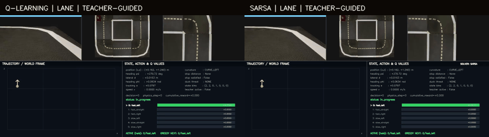

# Duckie MDP

Implementasi finite-state MDP berbasis privileged simulator state untuk tiga
perilaku Duckiebot pada `gym-duckietown-daffy`:

1. mengikuti lajur;
2. berhenti penuh di stop sign;
3. yield ketika pedestrian Duckie sedang menyeberang, lalu kembali berjalan.

Dua solver tabular tersedia: **Q-learning** dan **SARSA**. Teacher, bila
diaktifkan, hanya membantu eksplorasi saat training. Evaluasi dan seluruh video
selalu memakai greedy Q-table tanpa teacher.

Dokumentasi code per file tersedia di [code walkthrough](docs/code_walkthrough.md),
sedangkan Q-table, config, training log, dan evaluasi terpilih berada di
[arsip ablation](artifacts/ablation/README.md).

## Demonstrasi

### Lane following: Q-learning dan SARSA

Kedua panel berikut memakai guided exploration selama fase awal training.



### Full task: stop sign dan pedestrian

Stop sign dan crossing Duckie ditempatkan pada ruas berbeda. Dengan demikian,
berhenti di stop sign dan yield kepada pedestrian merupakan dua keputusan yang
berbeda, bukan satu event yang tumpang tindih.


### Teacher-guided versus tanpa teacher

Perbandingan berikut hanya untuk Q-learning karena SARSA tanpa teacher belum
dijalankan. Label `teacher-guided` berarti teacher pernah digunakan sebagai
behavior policy saat training, bukan saat evaluasi atau rendering.


GIF individual dan video 720p dipisahkan secara eksplisit:

| Regime | Lane | Stop + Duckie |
|---|---|---|
| Q-learning, teacher | [GIF](docs/assets/gifs/lane_q_teacher.gif) · [MP4](docs/assets/videos/teacher/lane_q_learning.mp4) | [GIF](docs/assets/gifs/full_q_teacher.gif) · [MP4](docs/assets/videos/teacher/full_q_learning.mp4) |
| SARSA, teacher | [GIF](docs/assets/gifs/lane_sarsa_teacher.gif) · [MP4](docs/assets/videos/teacher/lane_sarsa.mp4) | [GIF](docs/assets/gifs/full_sarsa_teacher.gif) · [MP4](docs/assets/videos/teacher/full_sarsa.mp4) |
| Q-learning, tanpa teacher | [GIF](docs/assets/gifs/lane_q_no_teacher.gif) · [MP4](docs/assets/videos/no_teacher/lane_q_learning.mp4) | [GIF](docs/assets/gifs/full_q_no_teacher.gif) · [MP4](docs/assets/videos/no_teacher/full_q_learning.mp4) |
| SARSA, tanpa teacher | Belum tersedia | Belum tersedia |

## Formulasi MDP

Task dimodelkan sebagai:

$$
\mathcal M=(\mathcal S,\mathcal A,P,R,\gamma,\rho_0,\mathcal T).
$$

- $\(\mathcal S\)$: state lane, stop sign, dan pedestrian;
- $\(\mathcal A\)$: tujuh macro-action differential drive;
- $\(P(s'\mid s,a)\)$: dinamika fisika dan objek dari simulator;
- $\(R(s,a,s')\)$: progress, stabilitas lane, keselamatan, dan kepatuhan;
- $\(\gamma=0.99\)$: discount factor;
- $\(\rho_0\)$: distribusi spawn dengan batas error lateral dan heading;
- $\(\mathcal T\)$: off-road, collision, atau goal. Timeout adalah truncation.

Simulator berfungsi sebagai **generative transition model**. Solver model-free
tidak menyimpan seluruh matriks $\(P\)$; setiap `env.step(action)` menghasilkan
satu sampel transition $\((s,a,r,s')\)$. Transition empiris dapat direkam untuk
Value Iteration, tetapi bukan syarat Q-learning maupun SARSA.

### State

Raw state policy adalah:

$$
s_t=(d_t,\phi_t,v_t,\kappa_t,d_t^{stop},\sigma_t^{stop},h_t^{duck}).
$$

| Komponen | Makna |
|---|---|
| $\(d\)$ | error lateral terhadap centerline lane |
| $\(\phi\)$ | error heading terhadap tangent lane |
| $\(v\)$ | kecepatan aktual ego |
| $\(\kappa\)$ | kurva 0,3 m di depan: lurus, kiri, atau kanan, ego-relative |
| $\(d^{stop}\)$ | jarak longitudinal ke stop line relevan |
| $\(\sigma^{stop}\)$ | satu bit memori: kewajiban stop sudah dipenuhi atau belum |
| $\(h^{duck}\)$ | `NONE`, `SIDE_FAR`, `SIDE_NEAR`, `CROSSING_FAR`, atau `CROSSING_NEAR` |

Untuk Q-table, heading digabung dengan lateral error menjadi tracking error
$\(e=\phi+d\)$. State diskrit adalah:

$$
\bar s=(bin(d),bin(e),bin(v),\kappa,bin(d^{stop}),\sigma^{stop},h^{duck}).
$$

Ukuran setiap dimensi adalah $\((5,5,3,3,4,2,5)\)$, sehingga terdapat
$\(5\times5\times3\times3\times4\times2\times5=9.000\)$ state dan
63.000 pasangan state-action. Implementasinya ada di
[`src/state.py`](src/state.py) dan [`src/discretizer.py`](src/discretizer.py).

State ini bersifat privileged karena dibaca langsung dari simulator. Untuk
visuomotor policy, gambar kamera menjadi observation $\(o_t\)$, sedangkan state
di atas tetap menjadi latent state; formulasi tersebut berubah menjadi POMDP.

### Action

Duckiebot menggunakan differential drive, bukan steering angle Ackermann.
Action fisik adalah $\((v_{cmd},\omega_{cmd})\)$, lalu dikonversi menjadi command
roda:

$$
u_L=v-\frac{L\omega}{2},\qquad
u_R=v+\frac{L\omega}{2}.
$$

Action diskritnya:

| ID | Action | $\(v\)$ | $\(\omega\)$ |
|---:|---|---:|---:|
| 0 | `fast_left` | $\(v_{fast}\)$ | $\(+\omega_0\)$ |
| 1 | `fast_straight` | $\(v_{fast}\$) | 0 |
| 2 | `fast_right` | $\(v_{fast}\)$ | $\(-\omega_0\)$ |
| 3 | `slow_left` | $\(v_{slow}\)$ | $\(+\omega_0\)$ |
| 4 | `slow_straight` | $\(v_{slow}\)$ | 0 |
| 5 | `slow_right` | $\(v_{slow}\)$ | $\(-\omega_0\)$ |
| 6 | `brake` | 0 | 0 |

Lane-only memask action 6 agar diam tidak menjadi solusi palsu. Full-task
mengaktifkannya kembali. Nilai `v_fast` dan `v_slow` adalah normalized command,
bukan klaim kecepatan SI. Lihat [`src/actions.py`](src/actions.py).

### Reward

Reward dense dasarnya:

$$
r_t=\alpha_p v_t\cos(\phi_t)-\alpha_d d_t^2
-\alpha_\phi\phi_t^2-c_{step}+r_{pedestrian}+r_{idle}+r_{event}.
$$

- progress positif mendorong kendaraan maju sejajar tangent lane;
- penalti lateral dan heading menjaga lane;
- `collision_duck`, collision objek, dan off-road mendapat penalti besar;
- stop violation dihukum dan full stop mendapat bonus one-shot;
- pada no-teacher full-task, melaju saat `CROSSING_*` dihukum;
- diam ketika tidak ada crossing dan tidak ada kewajiban stop dihukum.

Reward terakhir penting untuk menutup reward hacking: policy lama dapat mencapai
timeout dengan brake permanen setelah yield. Evaluator sekarang tidak menganggap
timeout saja sebagai sukses. `task_success` juga mensyaratkan progress minimal
5 m dan brake ratio maksimal 25%.

### Terminal dan truncation

Terminal sejati adalah off-road, Duck collision, collision objek lain, dan goal
bila goal diaktifkan. Timeout 1.500 physics-step adalah truncation; TD target
tetap bootstrap karena task tidak secara fisik berakhir pada batas waktu buatan.
Pada eksperimen ini `goal_tile: null`, sehingga tujuan task adalah survival,
compliance, progress, dan tidak stagnan.

## DuckController

[`src/duck_controller.py`](src/duck_controller.py) menangani scene pedestrian:

1. menyalin map data dan menginjeksi Duckie/stop sign bila belum tersedia;
2. mengubah Duckie menjadi objek dinamis tanpa memodifikasi package map;
3. mengembalikan posisi, heading, velocity, dan status pedestrian saat reset;
4. memicu crossing hanya ketika crossing point berada di depan ego dan jaraknya
   berada pada interval trigger;
5. membatasi satu crossing per episode pada full-task;
6. membiarkan Duckie tetap di sisi jalan setelah selesai menyeberang.

Batas satu crossing mencegah Duckie langsung bolak-balik ketika ego masih yield.
Setelah `pedestrian_active=False`, state berubah menjadi `SIDE_*` dan agent harus
kembali berjalan. Duckie hanya relevan untuk brake ketika state `CROSSING_*`.

Stop sign dipisahkan secara spasial dari crossing Duckie. Kandidat sign juga
difilter berdasarkan posisi lateral dan orientasinya terhadap arah lane ego,
sehingga sign milik arah berlawanan tidak masuk state.

## Teacher saat training

Teacher bukan bagian dari MDP, reward, maupun Bellman target. Saat guided
exploration aktif, teacher sesekali mengganti action behavior berdasarkan error
lane, stop distance, atau crossing. Transition hasil action itu tetap dipelajari
dengan update solver biasa. Probabilitas teacher menurun menurut episode dan
menjadi nol pada fase akhir.

Pada evaluasi:

- `greedy=True`;
- epsilon nol secara efektif;
- teacher tidak dipanggil;
- dashboard video menampilkan `teacher active: False`.

## Q-learning

Q-learning adalah off-policy TD control:

$$
Q(s,a)\leftarrow Q(s,a)+\alpha
\left[r+\gamma\max_{a'}Q(s',a')-Q(s,a)\right].
$$

Untuk terminal sejati, target hanya $\(r\)$. Behavior training menggunakan
epsilon-greedy dengan random tie-breaking, sedangkan target memakai action
greedy pada $\(s'\)$. Implementasi ada di
[`src/agents/q_learning.py`](src/agents/q_learning.py).

No-teacher memakai dua teknik yang tetap model-free:

- epsilon dimulai dari 0,5 pada lane-only, lalu dikonsolidasikan pada 0,02;
- lane prior yang telah dipelajari disalin ke seluruh kombinasi konteks
  stop/Duckie. Setelah itu setiap konteks tetap diperbarui dari reward simulator.

## SARSA

SARSA adalah on-policy TD control:

$$
Q(s,a)\leftarrow Q(s,a)+\alpha
\left[r+\gamma Q(s',a')-Q(s,a)\right],
$$

dengan $\(a'\)$ benar-benar dipilih oleh behavior policy. Nama SARSA berasal dari
tuple $\((S,A,R,S',A')\)$. Berbeda dari Q-learning, target ikut mencerminkan
eksplorasi epsilon. Implementasinya ada di
[`src/agents/sarsa.py`](src/agents/sarsa.py).

## Training

### Setup

```bash
python -m venv .venv
source .venv/bin/activate
pip install -r requirements.txt
pytest -q
```

### Teacher-guided

```bash
# Lane Q-learning + transition logging opsional
python -m src.train --config configs/small_loop_lane_vi.yaml

# Lane SARSA
python -m src.train_sarsa --config configs/small_loop_lane_sarsa.yaml

# Full task, dimulai dari baseline lane yang diarsipkan
python -m src.train --config configs/small_loop_stop_duck_q.yaml
python -m src.train_sarsa --config configs/small_loop_stop_duck_sarsa.yaml
```

### Q-learning tanpa teacher

```bash
# Lane: eksplorasi 0,50 -> 0,02, lalu konsolidasi 0,02
python -m src.train --config configs/small_loop_lane_q_no_teacher.yaml
python -m src.train --config configs/small_loop_lane_q_no_teacher_finetune.yaml

# Full task: broadcast lane prior, lalu konsolidasi konteks keselamatan
python -m src.train --config configs/small_loop_stop_duck_q_no_teacher_explore.yaml
python -m src.train --config configs/small_loop_stop_duck_q_no_teacher.yaml
```

Run baru ditulis ke `runs/`, yang diabaikan Git. Exact historical config untuk
angka pada README berada bersama artifact masing-masing.

## Evaluasi dan hasil

Semua hasil memakai 30 episode greedy. `task success` full-task menggunakan
controller satu-crossing, progress minimal 5 m, dan brake ratio maksimal 25%.

### Lane following

| Solver     | Teacher saat Training |        Timeout | Mean (\lvert d \rvert) | Progress | Brake |
| ---------- | --------------------- | -------------: | ---------------------: | -------: | ----: |
| Q-learning | Ya                    |           100% |               0,0282 m |   7,96 m |    0% |
| SARSA      | Ya                    |           100% |               0,0282 m |   7,96 m |    0% |
| Q-learning | Tidak                 |           100% |               0,0465 m |   5,56 m |    0% |
| SARSA      | Tidak                 | Belum tersedia |                      — |        — |     — |


### Full task: fair evaluation

| Solver | Teacher saat training | Task success | Timeout | Stop | Duck collision | Yield | Progress | Brake |
|---|---:|---:|---:|---:|---:|---:|---:|---:|
| Q-learning | Ya | 93,3% | 93,3% | 100% | 0% | 65,1% | 7,36 m | 4,9% |
| SARSA | Ya | **96,7%** | **96,7%** | 100% | 0% | 65,1% | **7,39 m** | **4,1%** |
| Q-learning | Tidak | 70,0% | 100% | 100% | 0% | 62,6% | 5,04 m | 26,2% |
| SARSA | Tidak | Belum tersedia | — | — | — | — | — | — |

Teacher-guided lebih sample-efficient dan menghasilkan brake ratio lebih rendah.
No-teacher Q-learning mencapai 30/30 timeout tanpa collision/off-road, tetapi
hanya 70% episode melewati kriteria anti-stall. Karena itu hasil no-teacher belum
boleh disebut setara dengan teacher-guided.

### Ablation no-teacher

| Versi | Perubahan utama | Timeout | Stop | Yield | Progress | Brake | Temuan |
|---|---|---:|---:|---:|---:|---:|---|
| Lane v1 | epsilon decay terlalu lambat terhadap jumlah keputusan | 0% | — | — | 0,90 m | 0% | gagal lane following |
| Lane v2 | decay disesuaikan | 6,7% | — | — | 2,07 m | 0% | membaik, belum stabil |
| Lane v3 | konsolidasi epsilon 0,02 | 100% | — | — | 5,56 m | 0% | lane solved |
| Full v1 | tanpa pedestrian shaping | 76,7% | 100% | 1,0% | 4,23 m | 39,6% | mengabaikan crossing |
| Full v2 | bonus yield per-step | 83,3% | 80% | 80,8% | 1,89 m | 59,6% | reward hacking: over-brake |
| Full v3 | bonus yield dihapus | 73,3% | 100% | 0% | 2,26 m | 51,1% | sinyal keselamatan terlalu lemah |
| Full v4 | broadcast lane prior | 83,3% | 100% | 54,1% | 4,20 m | 34,7% | brake-lock akibat crossing berulang |
| Full v5 | satu crossing + penalti idle | 100% | 100% | 62,6% | 5,04 m | 26,2% | resume setelah yield |

Value Iteration juga diuji dari transition model empiris: hanya 93 state dan
209 state-action pair yang teramati, dengan coverage action 37,46%. Bellman
iteration konvergen secara numerik, tetapi policy 100% off-road karena model
tidak mencakup state-action yang diperlukan. Artefaknya disimpan sebagai
failure ablation, bukan diklaim sebagai solver berhasil.

## Memakai policy terbaik

```bash
python -m src.evaluate \
  --config configs/small_loop_stop_duck_q_no_teacher.yaml \
  --q-table artifacts/ablation/full_task/q_learning_no_teacher/q_table_best.npy

python -m src.render_multiview_video \
  --config configs/small_loop_stop_duck_q_no_teacher.yaml \
  --q-table artifacts/ablation/full_task/q_learning_no_teacher/q_table_best.npy \
  --output runs/q_no_teacher.mp4 \
  --seed 101 --fps 20 --max-steps 1500
```

Regenerasi GIF dokumentasi:

```bash
python scripts/make_demo_gifs.py
```

## Struktur direktori

```text
duckie-mdp/
├── artifacts/ablation/     # Q-table, config, CSV, dan evaluasi terpilih
├── configs/                # config aktif dan reproducible workflow
├── docs/assets/gifs/       # GIF individual dan comparison
├── docs/assets/videos/     # MP4 720p terkompresi
├── scripts/                # generator media dokumentasi
├── src/                    # MDP, solver, evaluator, renderer
└── tests/                  # unit/regression tests
```

Jangan memakai Q-table lama setelah mengubah state shape, action semantics,
reward, atau termination semantics. Latih ulang atau evaluasi ulang policy di
environment yang baru.
